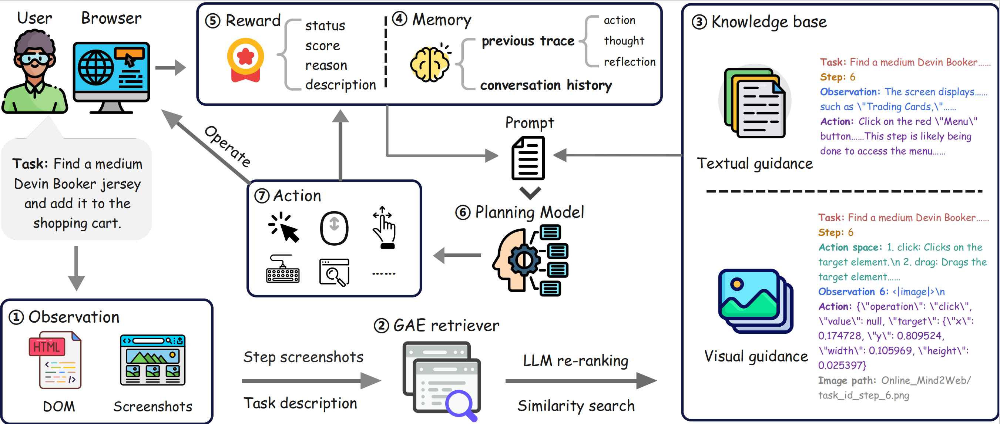

# Learning Multimodal Trajectory Representations for Web Agent Planning

This repository contains the official implementation for the work "Learning Multimodal Trajectory Representations for Web Agent Planning".



## Abstract
>Trajectory data, capturing multimodal human actions and states, are pivotal for building autonomous Web agents and transferring skills across tasks, encoding knowledge by compressing past experience into structured Markov sequences. Yet current methods for trajectory modeling remain fragmented, often relying on task-specific heuristics or textual signals. Progress on multimodal trajectories has been limited by the difficulty of representing visual information within long-step histories that exceed model context windows. Hence, how to effectively learn from multimodal trajectories remains a major and insufficiently addressed challenge amid ever-growing datasets. In this work, we introduce Multimodal Trajectory Representation Learning, bridging the gap between universal retrieval and agent-centric trajectory modeling. We construct the Unified Agent Trajectory Dataset (UATD) from annotated demonstrations and states across diverse real-world scenarios. Building on this, we present GAE-Bench, a benchmark containing numerous trajectory-based retrieval pairs. Our GAE-Retriever, a multimodal retriever based on vision-language models that uses token selection and GradCache to optimize the contrastive objective. Over multiple web-agent datasets, it surpasses strong baselines on retrieval recall. To demonstrate potential downstream applications, we develop WebRAGent, a retrieval-augmented web agent that integrates GAE-Retriever and supports both DOM- and vision-based observations. WebRAGent proves effective on both textual and visual retrieved knowledge, achieving performance gains of 16-22\% vs. non-retrieval on the Online-Mind2Web benchmark.

**This web agent system** offers comprehensive framework support for:

* Environment management
* Operation execution
* State tracking
* Error handling
* Trajectory retrieval
* RAG support
* Evaluation metrics


## 🚀 Get Started

### Setting Up the Environment

First, ensure your environment is ready by installing the necessary dependencies:

```bash 
conda create -n webragent python=3.11
conda activate webragent
pip install -r requirements.txt
```

Before running the repos, you need to set up the required API keys as using features dependent on external APIs. Please refer to this [docs](agent/LLM/README.md).

Also, you need to install the Node.js dependencies:

```bash
npm init -y
npm install axios
```
Then you need to set the google search api key and custom search engine id to perform google search action, for **Google blocked GUI agent based search lately**.

```bash
export GOOGLE_API_KEY=your_api_key
export GOOGLE_CX=your_custom_search_engine_id
```

OPEN_AI api setting
```bash
export OPENAI_API_KEY=your_api_key
```

Tips: To run in a Linux environment without a visual interface, use the following command to start:

```bash
    sudo yum install -y xorg-x11-server-Xvfb
```
Ubantu/Debian users can use the following command to install xvfb:
```bash    
    sudo apt-get update
    sudo apt-get install -y xvfb
```
You'll also need to install chromium
```bash
python -m playwright install chromium
```

### 🤖 Flow of execution
See "configs/setting.toml", "configs/embedding.toml" ,"batch_eval.py" and "batch_eval_op.py" for parameter Settings for evaluation.

Set the log path in "log.py"

**DOM Mode**
```bash
xvfb-run -a python batch_eval.py
```
**Vision Mode**
```bash
xvfb-run -a python batch_eval_op.py
```

#### tips: In batch_eval.py / batch_eval_op.py, use the rag_mode parameter to set the RAG mode


### 🔍 Evaluate data processing 
After getting the evaluation data set, use "utils/parser.py" to parse the log log file to get the json parsed file

Please set the parameters for the json file parsing step in "configs/log_config.json"

And then run the program

**DOM mode**
```bash
python utils/parser.py
python utils/dataset_process.py
```

**Vision mode**
```bash
python utils/operator_parser.py
python utils/operator_dataset_process.py --results_dir results_dir/ --output_dir dataset_dir/
```


The directory of the processed data set is：
```bash
results/
- task_id
-- trajectory
--- step_0_20250520-000604.png
--- step_2_20250520-000604.png
  ...
-- result.json
```

### 📋 Online-Mind2Web Benchmarking
Run the following command to generate the benchmark file:
```bash
bash OM2W_Benchmarking/eval.sh
```

Display evaluation results:
```bash
python OM2W_Benchmarking/statistic.py 
```